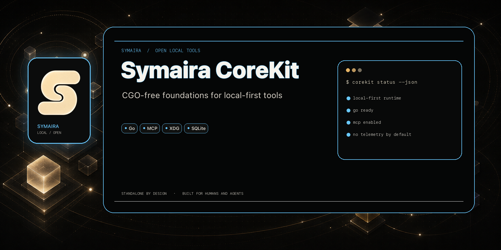

# symaira-corekit




Shared Go library for the Symaira public-core tools (`symvault`, `symmemory`, `symseek`, `symfetch`, `symscope`).

Bundles domain-free infrastructure that is otherwise duplicated across tools: MCP server scaffold, TOML config loading, exit codes, logging, path safety, SQLite setup, and update checking.

```sh
go get github.com/danieljustus/symaira-corekit@latest
```

Although `corekit` is a Go library, its conventions also guide the non-Go free tools (`symoperate`, `symtune`, `symterminal`, `symeraseme`). See [`docs/cross-language-conventions.md`](docs/cross-language-conventions.md) for the shared contracts that apply across languages.

## Why CoreKit?

- **Standalone-first:** every package works without any other Symaira tool installed — optional integrations are runtime contracts, never build-time imports.
- **CGO-free:** 100% pure Go on linux/darwin/windows (amd64+arm64); no platform toolchain required.
- **Cross-language conventions:** exit codes, XDG paths, env-var naming, and MCP stdio framing are shared contracts that also guide the Swift and Python free tools.
- **Strict SemVer:** API stability is guaranteed within major versions; consumers pin the module in `go.mod`.
- **Domain-free:** no Vault crypto, Memory PII rules, Seek ranking, Fetch fingerprinting, Scope scanning, or cloud/SaaS primitives.

## Install

```sh
go get github.com/danieljustus/symaira-corekit@latest
```

Import any package individually; each one is independently usable:

```go
import "github.com/danieljustus/symaira-corekit/logkit"
```

Consumers pin the module version in `go.mod` — see [Versioning](#versioning).

## Standalone-First Contract

Corekit is a shared foundation, not a runtime dependency graph between products.
Consumers must keep working when every other Symaira tool is absent. Optional
cross-tool behavior belongs behind runtime detection and fallback in the
consumer, not as imports from sibling tool repositories.

Corekit must stay free of Vault crypto, Memory PII policy, Seek ranking, Fetch
fingerprinting, Scope port scanning, billing, and other product- or
cloud-specific behavior.

## Packages

| Package | Since | Purpose |
|---------|-------|---------|
| `exitcodes` | v0.1.0 | Typed exit codes (`ExitOK`, `ExitError`, `ExitUsage`, `ExitAuth`) and `CLIError` type |
| `logkit` | v0.1.0 | Structured logging (`log/slog`) to stderr, configurable via `SYM<APP>_LOG_LEVEL` |
| `envutil` | v0.1.0 | Safe environment variable access with alias support |
| `fsutil` | v0.1.0 | Atomic file writes, path traversal validation, temp-file safety |
| `configkit` | v0.1.0 | TOML config loader with XDG paths, project overrides, and env vars |
| `domkit` | v0.9.0 | Shared semantic DOM pipeline for schema, selector, image, truncation, and markdown extraction |
| `embedkit` | v0.9.0 | Embedding provenance, provider abstraction, result caching, dimension pinning, and quantization-aware `SameSpace` identity checks |
| `evidencekit` | v0.4.0 | Grounded extraction contract (`SourceRef`, `Span`, `Extraction`, `AlignmentStatus`), JSONL sidecar encode/decode, exact/normalized text-span alignment, and grounded-only validation |
| `mcpserver` | v0.1.0 | Generic JSON-RPC 2.0 stdio server for MCP tool registration |
| `ollamakit` | v0.4.1 | CGO-free shared Ollama HTTP client: embeddings, streamed generation/chat, model discovery, and typed errors |
| `sqlitekit` | v0.1.0 | `modernc.org/sqlite` wrapper with WAL mode and embedded migrations |
| `updatecheck` | v0.1.0 | GitHub release checker (opt-in, max 1×/24h) |
| `updatecheck/updateapply` | v0.5.0 | Self-update installer: matching-asset download, checksum verification, atomic replacement with rollback, re-exec, and optional Cosign verification, archive extraction, and install-method detection |
| `updatecheck/cosign` | v0.6.0 | Cosign keyless signature verification for release checksums (Repo/BinaryName/IdentityRegexp parametrisierbar) |
| `updatecheck/extract` | v0.6.0 | Safe archive extraction (tar.gz/zip) with path-traversal protection |
| `updatecheck/installmethod` | v0.6.0 | Install-method detection: Homebrew, `go install`, package-manager, direct-download, build-from-source |
| `vectorkit/turboquant` | v0.2.0 | CGO-free TurboQuant scalar vector quantization: deterministic rotation, packed encode/decode, inner-product/cosine scoring, sidecar metadata, benchmarks |
| `versionkit` | v0.3.0 | Standardized handshake payload (`{tool, version, schema_version}`) for CLI tools |

Install the module with `go get github.com/danieljustus/symaira-corekit@latest` — see [Install](#install).

## Usage

```go
import "github.com/danieljustus/symaira-corekit/logkit"

// Reads MYAPP_LOG_LEVEL (debug|info|warn|error, default warn) and
// MYAPP_LOG_FORMAT (text|json, default text) from the environment.
logger := logkit.NewFromEnv("myapp")
logger.Info("started", "version", "1.0.0")
```

## Versioning

Strict SemVer. Each tool pins its corekit version in `go.mod`.

**Update expectation:** a consumer pins a version deliberately, but is expected
to move to the latest compatible minor release no later than that consumer's
own next release. Pinning is for stability between releases, not a license to
fall permanently behind. See [`docs/migrations.md`](docs/migrations.md) for
what changed in each minor release since v0.3.0.

Run `make consumer-drift` (or `scripts/consumer-drift.sh`) from this repo to
list every sibling Symaira repo checked out alongside it and the corekit
version each one currently pins — the tool that produced the table above.

## License

Apache-2.0 — Daniel Justus
